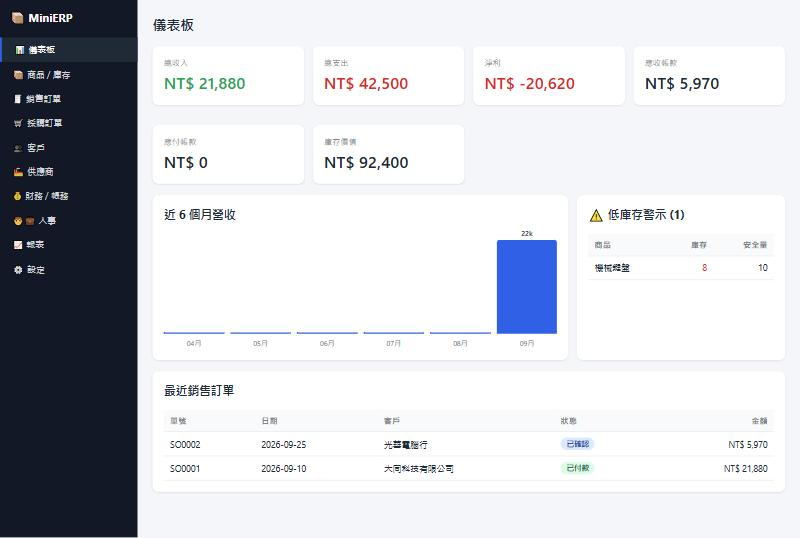

# MiniERP

零依賴、單檔的小型企業 ERP 系統。直接用瀏覽器開啟 `index.html` 即可使用，資料儲存於瀏覽器 localStorage。

**線上 Demo：https://ericwang2016.github.io/minierp/**

> Demo 的資料存在你自己的瀏覽器裡，不會上傳，也不會與其他訪客共用。

## 畫面

## 模組

| 模組 | 功能 |
|---|---|
| 儀表板 | 收入/支出/淨利、應收/應付、庫存價值、近 6 個月營收圖、低庫存警示 |
| 商品 / 庫存 | 商品主檔、成本/售價、安全庫存、手動調整庫存 |
| 銷售訂單 | 草稿 → 已確認 → 已出貨(扣庫存) → 已付款(自動記收入)；庫存不足會擋出貨 |
| 採購訂單 | 草稿 → 已確認 → 已收貨(加庫存、更新成本) → 已付款(自動記支出) |
| 客戶 / 供應商 | 聯絡主檔 |
| 財務 / 帳務 | 收支流水帳、應收/應付帳款、現金餘額 |
| 人事 | 員工主檔、在職人數、月薪總額 |
| 報表 | 商品銷售排行與毛利率、客戶貢獻、支出分類、庫存彙總 |
| 設定 | 公司名稱、貨幣、稅率；JSON 匯出/匯入/重置 |

## 使用

開啟[線上 Demo](https://ericwang2016.github.io/minierp/)，或 clone 後雙擊 `index.html`。首次開啟會載入示範資料，要清空重來可到「設定 → 重置為示範資料」，或匯入自己的 JSON 備份。

資料僅存在該瀏覽器，換裝置前請先用「設定 → 匯出 JSON」備份。

## 授權

[MIT](LICENSE)
